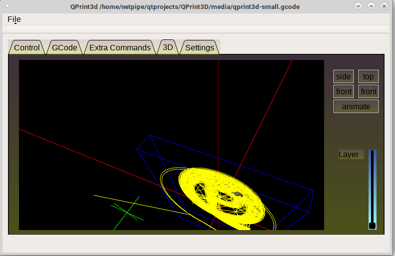
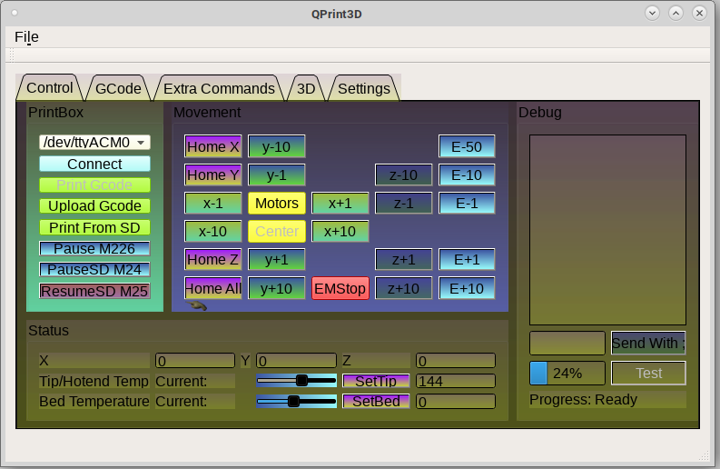

# QPrint3D
QT based 3d printer controller

not ready for actual use, development only

USE "./old" qt5 folder instead of the threaded source in the main folder

for some reason openglwidgets is missing on suse 15.5 in qt so you may need to use qt6 somehow

